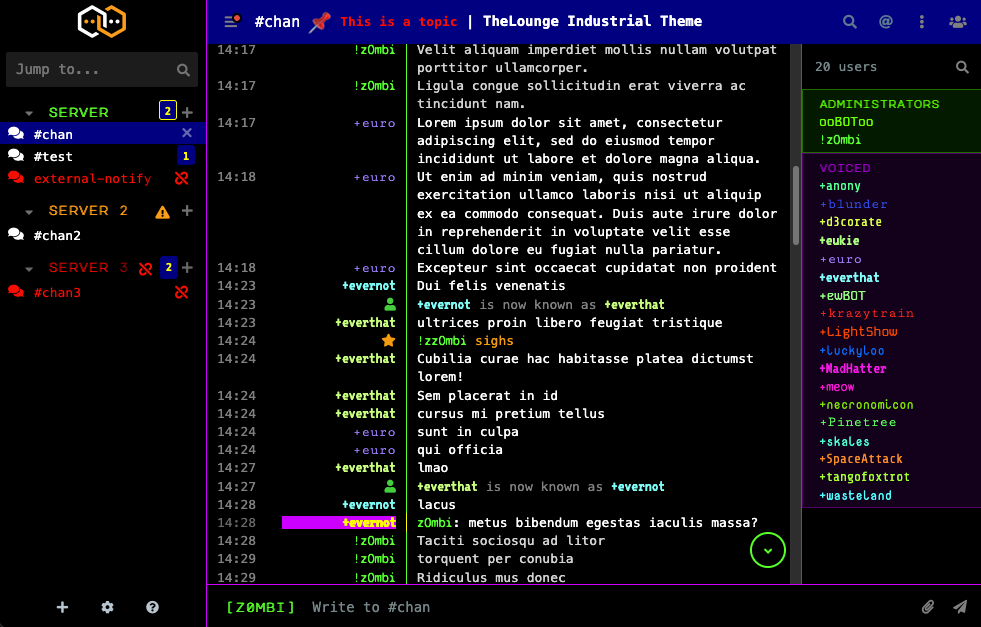
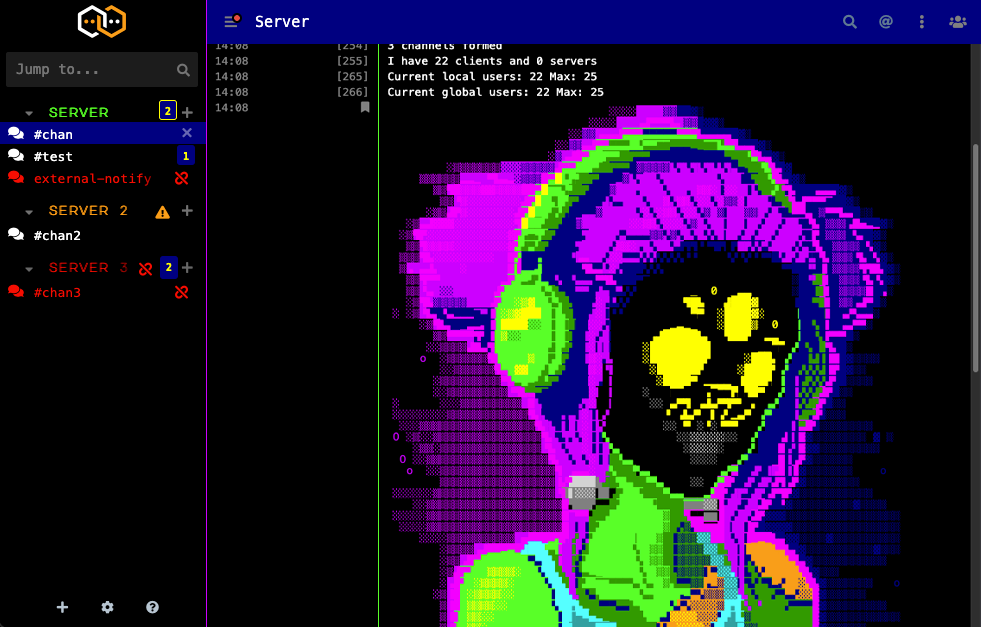
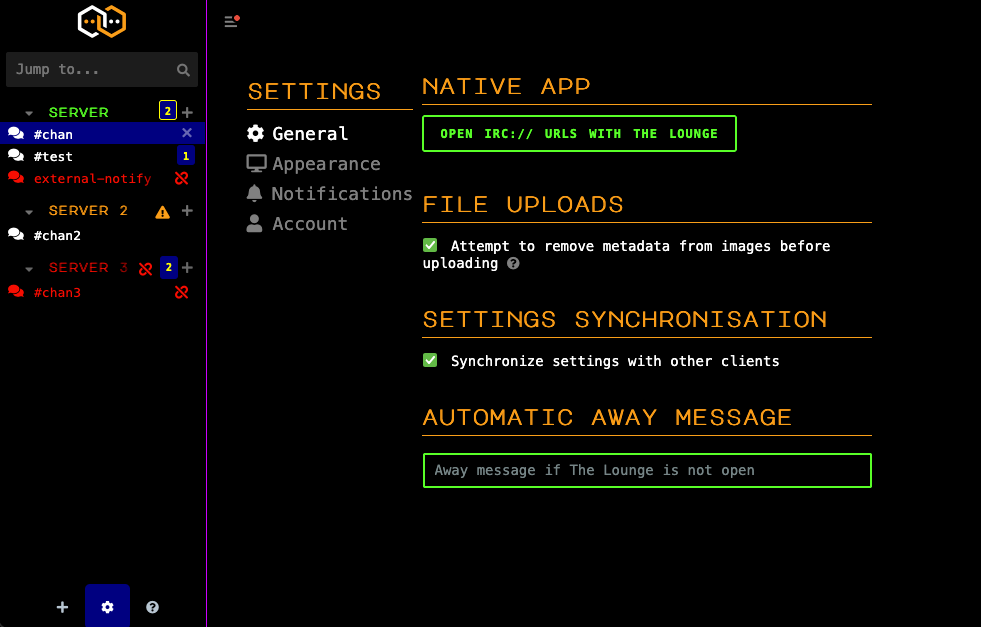

# thelounge-theme-industrial
A 16-color monospaced theme for [TheLounge](https://thelounge.chat/), a self-hosted web IRC client.

Default dark mode, but follows your system theme settings.







## Build CSS

```sh
npm install
npm run build
```

`theme.css` is committed build output. Required for a lounge theme.

`sass` is pinned to an exact version 1.102.0, reviewed 2026-09-16. Check provenance and
advisories before moving it.